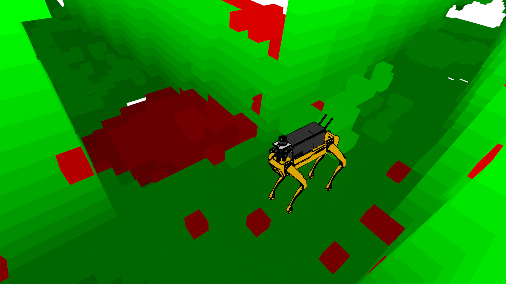

# Generative 3D Occupancy Mapping
This repo demonstrates generative 3D occupany mapping using a diffusion model as demonstrated the the [Cited Works](#Inspiration & Cited Works).

Image if you could predict the floor beneath a robot when it starts up or fill in holes in the voxel map when a robot turns a corner and the sensor configuration prevents filling the floor. This is the idea behind generative 3D occupancy mapping. We can generate occupancy predictions and merge them into the running occupancy map to help the robot complete areas of the map where it may be missing information from direct sensor observations. See the papers this work is based on below!





# Inspiration & Cited Works
If this work inspires yours, please consider citing the relevant papers.

This idea was introduced in SceneSense:
```
@INPROCEEDINGS{10802589,
  author={Reed, Alec and Crowe, Brendan and Albin, Doncey and Achey, Lorin and Hayes, Bradley and Heckman, Christoffer},
  booktitle={2024 IEEE/RSJ International Conference on Intelligent Robots and Systems (IROS)}, 
  title={SceneSense: Diffusion Models for 3D Occupancy Synthesis from Partial Observation}, 
  year={2024},
  pages={7383-7390},
  keywords={Geometry;Three-dimensional displays;Runtime;Source coding;Diffusion models;Cameras;Real-time systems;Planning;Trajectory;Intelligent robots},
  doi={10.1109/IROS58592.2024.10802589}}
```

Then enahnced and adapted to new platforms and environments in follow on works:

```
@article{reed2024online,
  title={Online diffusion-based 3d occupancy prediction at the frontier with probabilistic map reconciliation},
  author={Reed, Alec and Achey, Lorin and Crowe, Brendan and Hayes, Bradley and Heckman, Christoffer},
  journal={arXiv preprint arXiv:2409.10681},
  year={2024}
}
```
```
@misc{achey2025robustroboticexplorationmapping,
      title={Robust Robotic Exploration and Mapping Using Generative Occupancy Map Synthesis}, 
      author={Lorin Achey and Alec Reed and Brendan Crowe and Bradley Hayes and Christoffer Heckman},
      year={2025},
      eprint={2506.20049},
      archivePrefix={arXiv},
      primaryClass={cs.RO},
      url={https://arxiv.org/abs/2506.20049}, 
}
```